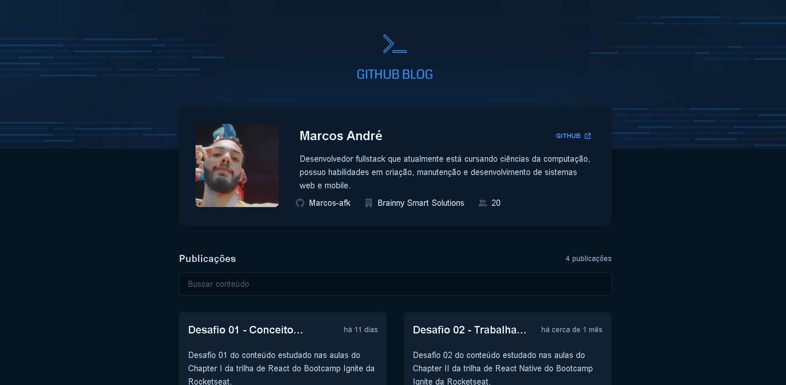

# Github Blog

<div align="center">
	
</div>

## :dart: Objetivo

Desafio 03 do conteúdo estudado nas aulas do Chapter III da trilha de React do
Bootcamp Ignite da Rocketseat.

## :hammer_and_wrench: Ferramentas

- [axios](https://www.npmjs.com/package/axios)
- [react](https://pt-br.reactjs.org/)
- [styled-components](https://styled-components.com/)
- [use-context-selector](https://www.npmjs.com/package/use-context-selector)
- [typescript](https://www.typescriptlang.org/)

## :desktop_computer: Padronização de código

- [Eslint](https://eslint.org/)
- [Prettier](https://prettier.io/)
- [EditorConfig](https://editorconfig.org/)

## :rocket: Executando o projeto

```bash
// Instale as dependências

yarn install

// Concluindo a instalação rode

yarn dev
```
